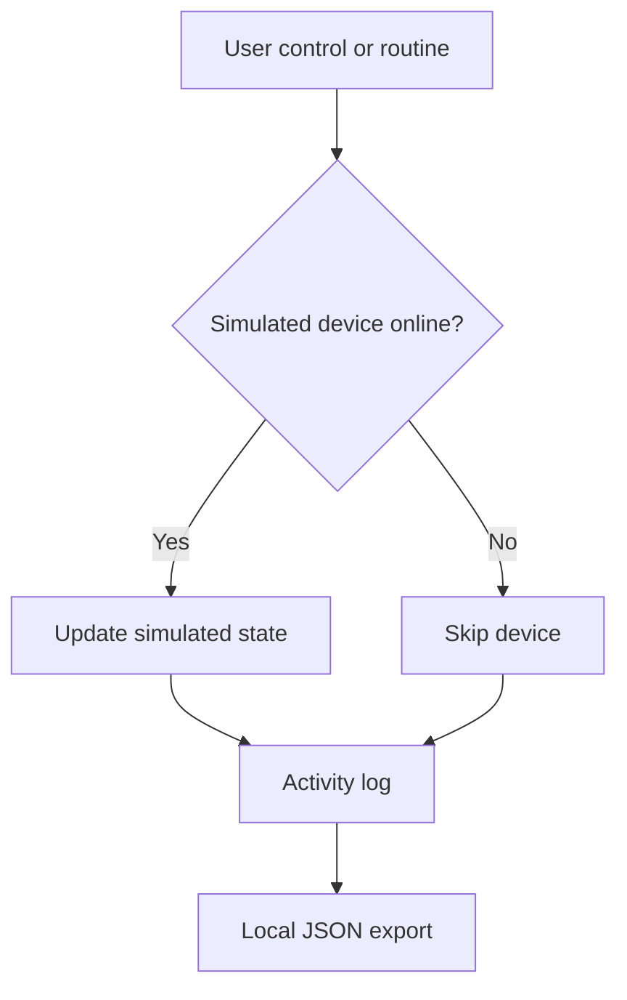
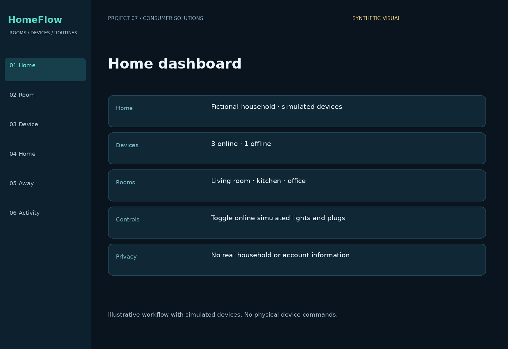
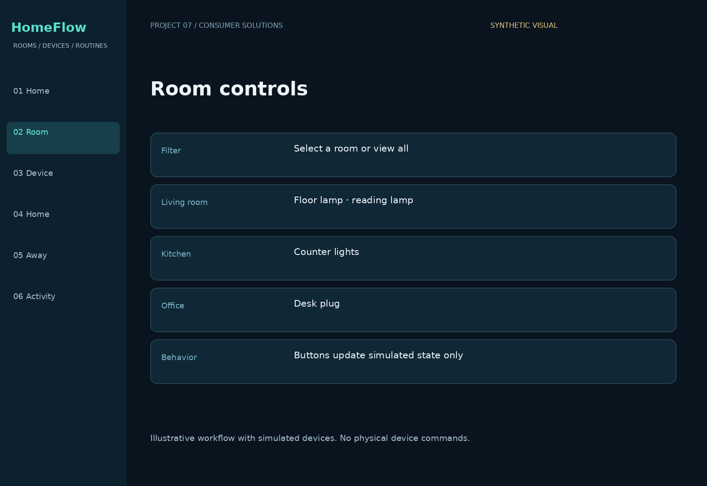
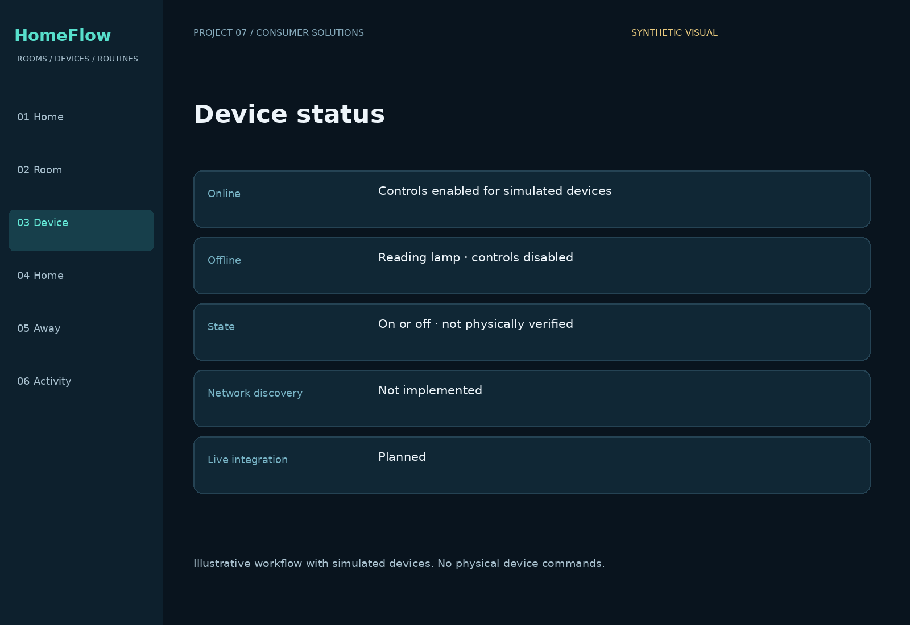
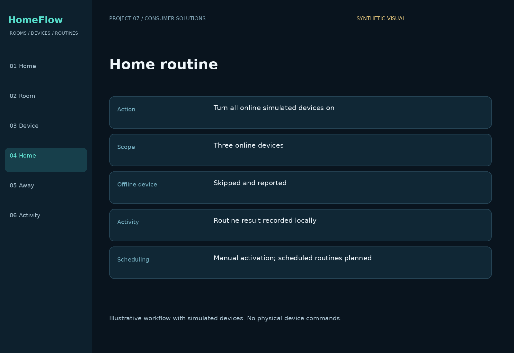
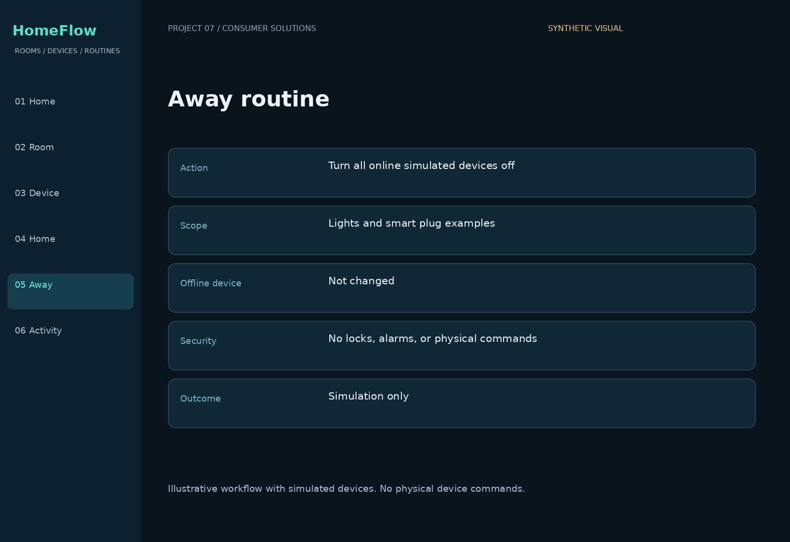
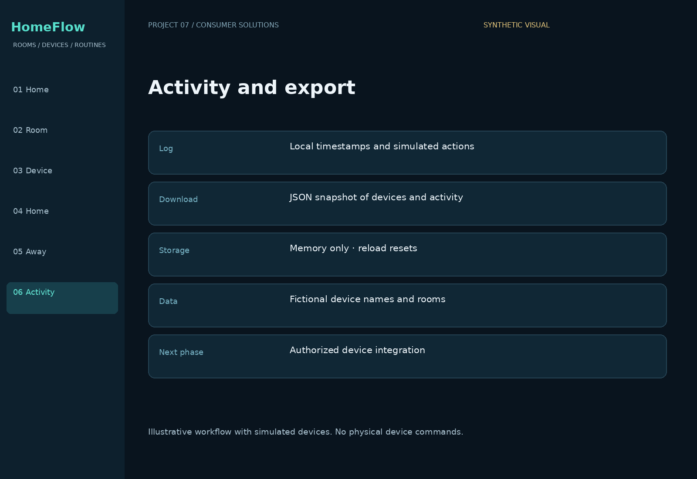

# HomeFlow — Home Automation Dashboard

**Federico Veneziano · Portfolio Project #7**

A simple consumer-solutions prototype for room controls, device status, and Home/Away routines using a fictional household and simulated devices.

## Everyday problem
People want a clear way to see device states and apply useful household routines. HomeFlow demonstrates those interactions without requiring hardware or using private household data.

## Working demo
Open `demo/index.html` in a browser. Toggle online lights and plugs, filter by room, apply Home or Away mode, and download the simulation activity snapshot as JSON.

- Four simulated devices across three rooms.
- Online/offline states with offline controls disabled.
- Home mode turns online devices on; Away turns them off.
- Offline devices are skipped and reported in the activity log.
- Manual changes switch the routine label to Custom.
- Timestamped activity and JSON export.

## Boundaries
This demo makes **no physical device commands**, network requests, account connections, or hardware discoveries. Data is kept in memory and resets on reload. It does not control locks, alarms, thermostats, or appliances. Real integrations, authenticated users, durable history, and scheduled routines are planned. No AI model is connected and no energy savings are claimed.

## Workflow

## Portfolio visuals
Illustrated workflow views with fictional devices, not live app screenshots or evidence of hardware control.

### Home dashboard

### Room controls

### Device status

### Home routine

### Away routine

### Activity and export

## Files and checks
- `demo/index.html`: runnable consumer demo.
- `src/home.js`: simulated routine and device logic.
- `tests/home.test.cjs`: online/offline and immutable-state checks.
- `docs/architecture.md`: current and planned architecture.

Run checks: `node tests/home.test.cjs`.

## Skills demonstrated
Consumer workflow design · home automation concepts · device-state handling · clear interaction design · activity reporting · integration boundaries.
